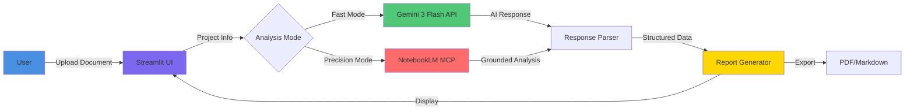

# Mapae (마패) - AI Powered Game Policy Auditor

> **[작동 프로토타입 · 심사 정확도 측정전 · 법률자문 아님]**
> 모든 REJECT-Risk 스코어 및 판정은 *공개 정책 문서 기반 추정*이며 실 심사 데이터·통계에서 도출된 수치가 아닙니다.
> 이 도구는 법률 자문을 제공하지 않습니다.

**Automated compliance analysis for game developers targeting multiple app stores**

Mapae is an intelligent policy compliance auditor that analyzes game design documents against Google Play Store, Apple App Store, and Toss platform policies using advanced AI technology.

---

## 🎯 Key Features

### 🚀 Hybrid Analysis Engine
- **Fast Mode**: Quick analysis using Google Gemini 3 Flash API
- **Precision Mode**: Deep analysis with NotebookLM integration for grounded, citation-backed insights

### 🌍 Multi-Market Analysis
- **Google Play Store**: Compliance with Google's developer policies
- **Apple App Store**: Review against App Store Review Guidelines
- **Toss Platform**: Korean market-specific regulations and policies

### 📊 Intelligent Reporting
- **Verdict System**: PASS / WARNING / REJECT / UNKNOWN / ERROR
- **Issue Detection**: Automatic identification of policy violations
- **Actionable Recommendations**: Practical solutions for compliance

### 🎨 Premium UI/UX
- Modern, responsive Streamlit interface
- Dark theme with glassmorphism effects
- Real-time analysis progress tracking
- PDF and Markdown report export

---

## 🏗️ Architecture



### Component Overview

1. **MapaeInput**: Handles user input collection (game info, documents)
2. **MapaeJudge**: AI-powered analysis engine with dual-mode support
3. **Streamlit UI**: Premium interface with real-time feedback
4. **Report Generator**: PDF and Markdown export functionality

---

## 🛠️ Tech Stack

| Category | Technology |
|----------|-----------|
| **Framework** | Streamlit 1.32+ |
| **AI Engine** | Google Gemini 3 Flash Preview |
| **Deep Analysis** | NotebookLM MCP |
| **Document Processing** | PyPDF2, python-docx |
| **Report Generation** | ReportLab, Markdown |
| **Language** | Python 3.8+ |

---

## 📦 Installation

### Prerequisites
- Python 3.8 or higher
- Google AI API Key ([Get one here](https://ai.google.dev/))
- Node.js (for NotebookLM integration, optional)

### Setup

1. **Clone the repository**
```bash
git clone <repository-url>
cd Mapae
```

2. **Install dependencies**
```bash
pip install -r requirements.txt
```

3. **Configure API credentials**

Create or edit `config.txt`:
```ini
# Google AI API Key (Required)
GOOGLE_API_KEY=your_api_key_here

# NotebookLM Integration (Optional)
USE_NOTEBOOKLM=false
NOTEBOOKLM_NOTEBOOK_ID=
```

4. **Run the application**
```bash
streamlit run app.py
```

The application will open in your browser at `http://localhost:8501`

---

## 🚀 Usage

### Quick Start

1. **Enter Project Information**
   - Game name
   - Genre (Action, RPG, Puzzle, etc.)
   - Target markets

2. **Provide Game Design Document**
   - Upload PDF/DOCX files, or
   - Paste text directly

3. **Choose Analysis Mode**
   - Fast Mode: Quick results (5-10 seconds)
   - Precision Mode: Deep analysis with citations (30-60 seconds)

4. **Review Results**
   - View platform-specific verdicts
   - Check identified issues
   - Read actionable recommendations

5. **Export Reports**
   - Download PDF report
   - Export Markdown summary

### Analysis Modes

#### Fast Mode (Default)
- Uses Gemini 3 Flash API
- Quick turnaround time
- Suitable for initial reviews

#### Precision Mode (NotebookLM)
- Grounded analysis with citations
- Policy document references
- Ideal for final compliance checks

---

## 📋 Verdict System

| Verdict | Meaning | Action Required |
|---------|---------|-----------------|
| ✅ **PASS** | Policy compliant | Ready for submission |
| ⚠️ **WARNING** | Minor concerns | Review recommended |
| ❌ **REJECT** | Policy violation | Must fix before submission |
| ❓ **UNKNOWN** | Unclear verdict | Manual review needed |
| 🔴 **ERROR** | Analysis failed | Retry or contact support |

---

## 📁 Project Structure

```
Mapae/
├── app.py                 # Main Streamlit application
├── mapae_input.py         # Input handling module
├── mapae_judge.py         # AI analysis engine
├── config_loader.py       # Configuration management
├── config.txt             # User configuration (gitignored)
├── CONFIG_GUIDE.md        # Configuration documentation
├── requirements.txt       # Python dependencies
└── README.md              # This file
```

---

## 🔧 Configuration

### Environment Variables

| Variable | Description | Required |
|----------|-------------|----------|
| `GOOGLE_API_KEY` | Google AI API key | Yes |
| `USE_NOTEBOOKLM` | Enable NotebookLM integration | No |
| `NOTEBOOKLM_NOTEBOOK_ID` | NotebookLM notebook ID | No* |

*Required if `USE_NOTEBOOKLM=true`

### Advanced Configuration

See [CONFIG_GUIDE.md](CONFIG_GUIDE.md) for detailed configuration options.

---

## 🎨 UI Features

- **Dark Theme**: Professional dark mode with high contrast
- **Responsive Design**: Works on desktop and tablet
- **Real-time Feedback**: Progress indicators and status updates
- **Accessibility**: WCAG 2.1 compliant color scheme
- **Export Options**: PDF and Markdown report generation

---

## 🧪 Testing

The application has been tested with:
- Various game genres (Action, RPG, Puzzle, Casual)
- Multiple document formats (PDF, DOCX, plain text)
- Different policy scenarios (gacha, IAP, ads, age ratings)
- Both analysis modes (Fast and Precision)

---

## 🔒 Security & Privacy

- **API Keys**: Stored locally in `config.txt` (gitignored)
- **Data Processing**: All analysis happens server-side
- **No Data Storage**: Documents are not permanently stored
- **Privacy First**: No user data collection or tracking

---

## 📝 License

MIT License

Copyright (c) 2026 Mapae Project

Permission is hereby granted, free of charge, to any person obtaining a copy
of this software and associated documentation files (the "Software"), to deal
in the Software without restriction, including without limitation the rights
to use, copy, modify, merge, publish, distribute, sublicense, and/or sell
copies of the Software, and to permit persons to whom the Software is
furnished to do so, subject to the following conditions:

The above copyright notice and this permission notice shall be included in all
copies or substantial portions of the Software.

THE SOFTWARE IS PROVIDED "AS IS", WITHOUT WARRANTY OF ANY KIND, EXPRESS OR
IMPLIED, INCLUDING BUT NOT LIMITED TO THE WARRANTIES OF MERCHANTABILITY,
FITNESS FOR A PARTICULAR PURPOSE AND NONINFRINGEMENT. IN NO EVENT SHALL THE
AUTHORS OR COPYRIGHT HOLDERS BE LIABLE FOR ANY CLAIM, DAMAGES OR OTHER
LIABILITY, WHETHER IN AN ACTION OF CONTRACT, TORT OR OTHERWISE, ARISING FROM,
OUT OF OR IN CONNECTION WITH THE SOFTWARE OR THE USE OR OTHER DEALINGS IN THE
SOFTWARE.

---

## 🤝 Contributing

This is a portfolio project. If you'd like to suggest improvements:

1. Fork the repository
2. Create a feature branch
3. Submit a pull request with detailed description

---

## 📧 Contact

For questions or feedback about this project, please open an issue on GitHub.

---

## 🙏 Acknowledgments

- **Google Gemini**: For providing the AI analysis engine
- **NotebookLM**: For grounded, citation-backed analysis
- **Streamlit**: For the excellent web framework
- **Open Source Community**: For the amazing tools and libraries

---

**Built with ❤️ for game developers**
